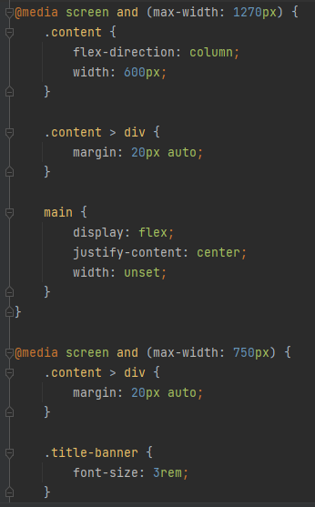
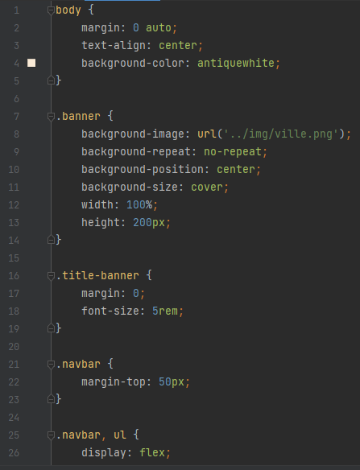
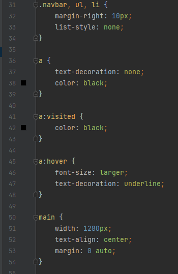

# Test Orosand
## Fichiers
- Index.html : la home page
- Page-exemple.html : une page du site
- Un dossier 'style' avec un fichier style.css : contient le CSS du site
- Un dossier 'img' : contient les images du site
## Structure du site
- Une partie head qui contient les meta, le titre et le link du fichier css
- Une partie body avec :
  * Un header qui contient une div qui est utilisé comme bannière ainsi qu'une navbar
  * Un main avec une div qui englobe 2 autres div afin de les disposer en colonnes avec chacunes
une image et du texte
  * Un footer
## Le CSS
J'ai ciblé les différentes div et/ou éléments à l'aide de class pour leur appliquer le style que je
souhaitais.
## Le responsive
A l'aide des @media screen j'ai pu adapter le site à partir de certaines largeur (à partir de 1270px et
750px) comme passer mes colonnes de texte en colonne pour qu'elles ne sécrasent pas.

Illustration :

Annexes CSS

